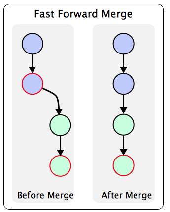

# Merging strategies
One of the main advantages of Git is that it enables cooperators to work on different branches, which is convenient for an isolation of changes and organised parallel development process. Each branch is dedicated to a specific component of the project, collectively contributing to the comprehensive end result. However, in order to result in a final version of the project, the various branches of code must be merged together, and there are multiple ways to achieve that, depending on the given situation. This GitHub repository briefly describes the fundamental merging methods in Git and then elaborates on their advanced alternatives.
  
## Contents
- [Fundamental merging algorithms](#fundamental-merging-algorithms)
    - [Fast-Forward](#fast-forward)
    - [Three-way](#three-way)
- [Advanced merging algorithms](#advanced-merging-algorithms)
    - [No Fast-forward](#no-fast-forward)
    - [Ort](#ort)
    - [Recursive](#recursive)
    - [Resolve](#resolve)
    - [Octopus](#octopus)
    - [Ours](#ours)
    - [Subtree](#subtree)
- [Sources](#sources)

## Fundamental merging algorithms
In Git, there are two basic merging algorithms, fast-forward merging and three-way merging. These algorithms are used to combine changes from one branch into another branch. The choice of merging algorithm depends on the branch histories and whether there are any conflicts between the branches being merged.

### Fast-Forward 

```bash
git merge source_branch
```

Fast-forward merging is a straightforward process occurring when there are no new commits on the target branch since the divergence point. Git simply moves the branch pointer of the target branch forward to the tip of the source branch, effectively incorporating the changes. This results in a linear commit history and is often used for simple feature branches or bug fixes.

On the [Figure 1](#ff-merge) is the git graph before and after calling the merge. You can see the main branch in blue and dev branch in green. Please note that the changes are only on the dev branch. After the fast-forward merge occurred, a linear commit history with a moved branch pointer has been created. Thus, the changes in the dev branch were incorporated into the main branch. 

<figure id="ff-merge" style="text-align: center;">
  
  <figcaption>Figure 1: Fast-Forward merging</figcaption>
</figure>
<p style="text-align: center;">
  Image source: www.bogotobogo.com 
</p>
<https://www.bogotobogo.com/DevOps/SCM/Git/Git_GitHub_Fast-Forward_Merge.php>

### Three-Way

```bash
git merge -s ort source_branch
```

Unlike fast-forward merges, three-way merges are employed when both the source and target branches have received new commits since their divergence. This scenario requires Git to perform a more complex merge, taking into account the common ancestor of the branches. Git then compares the changes introduced in each branch since that point. It then creates a new merge commit that reconciles these changes. This method ensures a comprehensive merging process that takes into account the contributions from both branches.

Below you can find [Figure 2](#tw-merge) to see the before and after Git graphs of the three-way merge.
  
<figure id="tw-merge" style="text-align: center;">
  
  <figcaption>Figure 2: Three-way merging</figcaption>
</figure>
<p style="text-align: center;">
  Image source: www.dev.to
</p>
<https://dev.to/neshaz/how-to-use-git-merge-the-correctway-25pd>


## Advanced merging algorithms
It might happen that the branch structure is more complex than in the previously mentioned fundamental merging strategies. For such situations, git provides a range of sophisticated merging algorithms that go beyond the basic fast-forward and three-way merges. These advanced merging strategies are designed to handle complex development workflows. As software projects grow in size and complexity, mastering these advanced merging techniques becomes increasingly essential for developers and teams striving for efficient code management, collaboration, and version control.

### No Fast-Forward

```bash
git merge --no-ff source_branch
```

Occasionally, you want to prevent Git from just moving your branch pointer to the incoming commit, typically because you want to maintain a specific branch topology (e.g. you're merging in a topic branch and you want to ensure it looks that way when reading history). In order to do that, you can pass the --no-ff flag and git merge will always construct a merge instead of fast-forwarding.

### Ort

```bash
git merge -s ort source_branch
```

This is the default merge strategy when pulling or merging one branch and the name is an acronym of Ostensibly Recursive’s Twin as it replaces the previous default algorithm, recursive. 
Ort is able to resolve only two heads using the three-way merge algorithm, and it does so by detecting a common ancestor or creating a tree of these ancestors using 3-way-merge to create inner-merges which will provide the common ancestor. 
This strategy results in fewer merge conflicts and can detect and handle merges involving renames. It does not make use of detected copies.
It provides quite significant increase in speed for large repositories and solve corner cases which were hard for recursive.

### Recursive

```bash
git merge -s recursive source_branch
```

Recursive was the default strategy for resolving two heads from Git v0.99.9k until v2.33.0. 
It is similar to ort as in case there is more ancestors it creates merged tree of the common ancestors for 3-way-merge.
This strategy takes the same options as ort, nevertheless, there are three additional options ignored by ort, which might be useful with recursive.

### Resolve

```bash
git merge -s resolve source_branch
```

Resolve is an advanced strategy which resolves two heads using the three-way merging algorithm. Careful detection of criss-cross merge ambiguities (i.e. complex branching and merging scenarios which make it difficult for the system to automatically determine the correct merge path) then leads to a stop of the merging process and manual conflict resolution. Resolve does not handle renames.
In oppose to the recursive and ort strategies, in case of more ancestors, it picks one of them random for the 3-way-merge.

### Octopus

```bash
git merge -s octopus branch_1 branch_2 ... branch_n
```

The octopus merge strategy is designed to resolve cases with more than two heads and is the default strategy for pulling or merging more than one branch. It avoids complex manual resolution and, hence is intended for merging scenarios where Git can automatically determine the merge outcome without user intervention. Primarily meant for bundling topic branch heads together, such as merging multiple feature branches into a main development branch.
The main advantage is that when we need to merge multiple branches it creates only single merge commit.

### Ours

```bash
git merge -s ours source_branch
```

This strategy resolves any number of heads, but it prioritizes the current branch's changes over others. It is primarily meant to be used to supersede the old development history of side branches. 
It is useful when we want to keep the history of the branch without incorporating the changes. Please do not exchange for the ours option of the recursive merge strategy.

### Subtree

```bash
git merge -s subtree branch_A branch_B
```
It is extension of recursive strategy in case we have two projects, A and B where B is subdirectory of A.
When merging B into A Git ensures that the tree structure of B aligns with that of A. 
This means that if B corresponds to a subdirectory within A, 
Git will adjust the structure of B to match the subdirectory's location in A.


## Sources: 
https://git-scm.com/docs/git-merge  
https://git-scm.com/docs/merge-strategies  
https://www.atlassian.com/git/tutorials/using-branches/git-merge
https://www.atlassian.com/git/tutorials/using-branches/merge-strategy  
https://www.geeksforgeeks.org/merge-strategies-in-git/  

